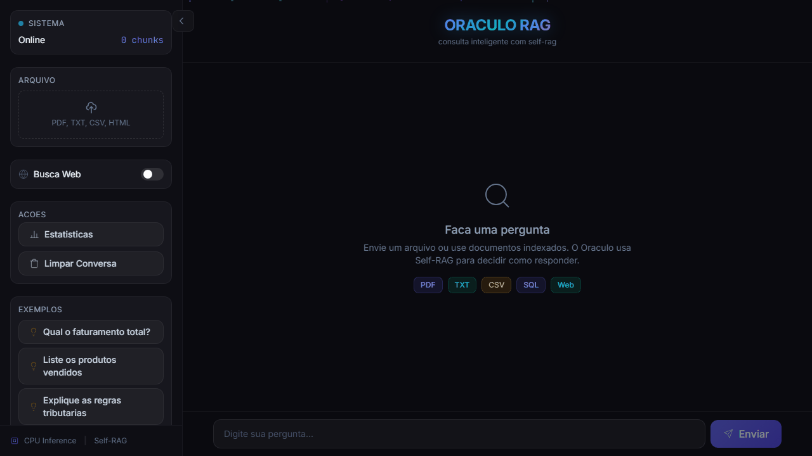

# Oracle RAG

Sistema de oraculo RAG leve para CPU com Self-RAG, consulta a documentos (PDF, TXT, CSV, HTML) e bancos de dados (SQLite, Firebird).

> **Status: EM DESENVOLVIMENTO** — Este projeto esta em fase ativa de desenvolvimento. Nao esta pronto para uso em producao. Funcionalidades podem mudar, quebrar ou serem removidas sem aviso previo.

## Funcionalidades

- Upload de documentos (PDF, TXT, CSV, HTML) e consulta em linguagem natural
- Indexacao persistente para consultas futuras
- Busca hibrida (BM25 + embeddings densos + reranker)
- Self-RAG: oraculo decide quando buscar, avaliar confianca e reformular perguntas
- SQL Generator automatico para bancos conectados (SQLite, Firebird .ECO)
- Web fallback (busca na web se nao encontrar nos documentos)
- Interface web (Vue 3 + Tailwind + FastAPI)
- CLI para terminal

## Requisitos

- Python 3.10+
- Node.js 18+ (para build do frontend)
- 4-8GB RAM (CPU)
- ~500MB de espaco em disco para indices e cache

## Instalacao

```bash
# Clonar
git clone <url>
cd light-oracle

# Backend
python -m venv venv
.\venv\Scripts\pip install -r requirements.txt

# Frontend
cd web/frontend
npm install
npm run build
cd ../..
```

## Demonstracao



## Configuracao

Edite o arquivo `.env` na raiz do projeto:

```bash
notepad .env
```

Todas as opcoes disponiveis com documentacao inline no proprio arquivo.

| Chave | Exemplo | O que faz |
|---|---|---|
| `ORACLE_EMBED_MODEL` | `BAAI/bge-small-en-v1.5` | Modelo de embedding |
| `ORACLE_EMBED_DIM` | `256` | Dimensao do vetor |
| `ORACLE_CHUNK_SIZE` | `512` | Tamanho do chunk |
| `ORACLE_CONFIDENCE_HIGH` | `0.60` | Threshold verde |
| `ORACLE_CONFIDENCE_MEDIUM` | `0.40` | Threshold amarelo |
| `ORACLE_WEB_PORT` | `8081` | Porta do servidor |
| `ORACLE_WEB_HOST` | `127.0.0.1` | Host do servidor |
| `ORACLE_WEB_FALLBACK` | `true` | Busca na web |
| `ORACLE_FB_HOST` | `localhost` | Firebird host |

## Uso

```bash
# Interface web
.\venv\Scripts\python run_web.py
# -> http://localhost:8081

# CLI - Modo ao vivo (arquivo + pergunta)
.\venv\Scripts\python -m oracle.cli ask "qual o valor total" --file nota.pdf

# CLI - Indexar documentos para consulta futura
.\venv\Scripts\python -m oracle.cli index ./documentos/

# CLI - Consultar documentos indexados
.\venv\Scripts\python -m oracle.cli ask "liste os produtos"

# CLI - Modo interativo
.\venv\Scripts\python -m oracle.cli interactive

# CLI - Conectar banco SQL e consultar
.\venv\Scripts\python -m oracle.cli sql "C:\Ecosis\Dados\LK.ECO" "SELECT * FROM treccliente"

# CLI - Busca na web
.\venv\Scripts\python -m oracle.cli web "aliquota icms SP"
```

## Estrutura

```
light-oracle/
├── oracle/               # Engine RAG
│   ├── engine.py         # Orquestrador principal (Self-RAG)
│   ├── models/           # Embedder, Reranker, GAU
│   ├── retrieval/        # BM25, Dense(FAISS), HyDE, Multi-Query, Web fallback
│   ├── pipeline/         # Parser, Chunker, Live, Persistent, SQL connector
│   ├── training/         # Self-RAG training (DPO)
│   └── utils/            # Config, Tokenizer, Cache
├── web/                  # Interface web
│   ├── server.py         # FastAPI
│   └── frontend/         # Vue 3 + Tailwind
├── .env                  # Configuracao do sistema
├── run_web.py            # Inicializador do servidor web
├── demo.py               # Script de demonstracao
└── requirements.txt      # Dependencias Python
```

## Licenca

MIT
